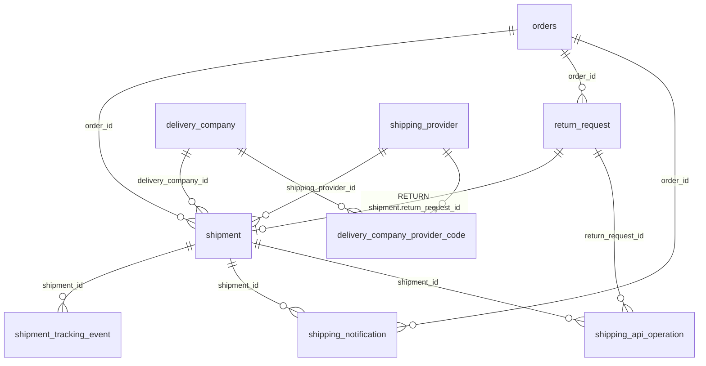

# BoutiqueCamel 배송 시스템 (2차: 도메인 재설계 · 외부 API 연동 기반)

## 0. 설계 원칙

| 개념 | 엔티티 | 책임 |
| --- | --- | --- |
| 상거래 | `orders` (Order) | 결제·주문 상태. 배송 상세를 직접 갖지 않음 |
| 물류 이동 | `shipment` (Shipment) | **배송 도메인의 중심.** 한 번의 물리적 이동 = 1행 (출고, 반품 회수, 향후 교환 회수/재발송) |
| 반품 업무 | `return_request` (ReturnRequest) | 반품 사유·승인·환불 같은 업무 상태만. 수거지·택배사·송장은 연결된 RETURN Shipment 가 가짐 |
| 택배사 | `delivery_company` (DeliveryCompany) | CJ대한통운, 한진 등 실제로 물건을 옮기는 회사 |
| 외부 API 업체 | `shipping_provider` (ShippingProvider) | 스마트택배(SweetTracker), 굿스플로 등 API 를 제공하는 회사. 택배사와 별개 |

- `ShipmentType`: `DELIVERY`, `RETURN` (구현), `EXCHANGE_RETURN`, `EXCHANGE_DELIVERY` (DB·enum 만 준비, 교환 기능 오픈 시 사용).
- 방향(출고/회수)은 상태가 아니라 **타입**으로 구분합니다. 반품 중인 택배는 `RETURN + IN_TRANSIT` 이며 `RETURN_IN_TRANSIT` 같은 상태는 없습니다.
- 주소 스냅샷: DELIVERY 는 주문서의 수령인 스냅샷(`orders.receiver_*`)을, RETURN 은 신청 시점의 수거지를 `shipment.contact_*` 에
  복사해 둡니다. 고객이 나중에 주소록을 수정해도 진행 중인 배송·회수 주소는 바뀌지 않습니다.
- 금액은 모두 원 단위 정수(`BIGINT` / Java `long`). 시간은 `TIMESTAMPTZ` / `Instant`.
- API 키·Client Secret 은 **DB 와 Git 에 저장하지 않습니다.** 서버 환경변수(`.env`)로만 관리합니다.

## 1. ERD



엔티티는 다른 엔티티를 JPA 연관관계가 아닌 `Long` id 로 참조합니다(지연 로딩·N+1 방지). 목록 화면은 id 를 모아 `IN` 조회로
한 번에 가져옵니다(`ShipmentViewAssembler.Refs`, `ReturnService.list`, `AdminOrderQueryService`).
신규 엔티티는 `common/domain/BaseEntity`(`created_at`, `updated_at`)를 상속합니다. soft delete 는 쓰지 않고, 필요한 곳만
`enabled` 플래그를 둡니다.

### 테이블

| 테이블 | 주요 컬럼 · 제약 |
| --- | --- |
| `shipment` | `shipment_type`, `return_request_id`(RETURN 일 때만, CHECK), `delivery_company_id`, `shipping_provider_id`, `tracking_number`, `status`, `contact_name/phone`, `postal_code`, `address1/2`, 단계별 시각(`pickup_requested_at`, `picked_up_at`, `shipped_at`, `out_for_delivery_at`, `delivered_at`), `last_tracking_checked_at`, `last_tracking_error`, `tracking_fail_count`, `last_status_changed_at`, `version`(낙관적 락) |
| `shipment_tracking_event` | 추가 전용 이력. `source`(INTERNAL = 쇼핑몰 처리, PROVIDER = 택배사 조회), `external_event_id`, `status`, `provider_status`(업체 원문 상태), `location`, `description`, `event_at`, `raw_hash`, `actor_member_id` |
| `return_request` | `reason_code`, `reason_text`, `customer_memo`(수거 요청사항), `status`, `free_return`, `return_shipping_fee`, `refund_amount`, `restocked`, `reject_reason`, `admin_memo`, 처리 시각들, `version` |
| `delivery_company` | 내부 코드(CJ, HANJIN, LOTTE, POST, LOGEN, ETC), 이름, 조회 URL 템플릿(`{trackingNumber}`), `enabled` |
| `shipping_provider` | 업체 코드(SWEETTRACKER, GOODSFLOW, MANUAL), `enabled`, 기능별 스위치 `tracking_enabled`, `waybill_enabled`, `pickup_enabled`, `return_pickup_enabled`. **비밀값 컬럼 없음** |
| `delivery_company_provider_code` | 업체별 택배사 코드. 예) 한진 → SWEETTRACKER `05`. `(delivery_company_id, shipping_provider_id)` UNIQUE |
| `shipping_policy` | 기본 배송비, 무료배송 기준, 제주/도서산간 추가비, 반품비, **교환비**. 여러 행 가능하나 `enabled` 는 하나만(부분 UNIQUE) |
| `shipping_extra_area` | 우편번호 범위(`postal_code_from/to`), `area_type`(JEJU/REMOTE), `area_name`, `extra_fee`(NULL 이면 정책 금액), `enabled`, `source`(MANUAL/OFFICIAL) |
| `shipping_api_operation` | 상태를 바꾸는 외부 호출 1건 = 1행. `idempotency_key`, `request_id`, `external_reference`, `status`(PENDING/SUCCEEDED/FAILED/UNKNOWN), `http_status`, `error_code/message`, `response_summary`(정제된 요약만), `attempt_count`, `requested_at`, `completed_at`, `applied_at` |
| `shipping_notification` | 고객 알림 기록. `(shipment_id, event_type)` UNIQUE 로 같은 알림은 한 번만 |

### 인덱스 · 제약

| 이름 | 목적 |
| --- | --- |
| `uq_shipment_company_tracking` | `(delivery_company_id, tracking_number)` UNIQUE, 송장 없는 행과 취소된 배송은 제외 |
| `uq_shipment_delivery_order` | 주문당 DELIVERY 1건 (분할 배송 도입 시 제거) |
| `uq_shipment_return_request` | 반품 요청당 RETURN Shipment 1건 |
| `uq_return_request_active` | 주문당 진행 중(또는 완료된) 반품 1건. 거절·철회된 반품은 다시 신청 가능 |
| `idx_shipment_tracking_poll` | 스케줄러 조회: `status` + `last_tracking_checked_at NULLS FIRST` (송장 있는 행만) |
| `uq_shipment_tracking_event_hash` / `_external` | 택배사 이벤트 중복 저장 방지 (`raw_hash`, `external_event_id`) |
| `uq_shipping_api_operation_idempotency` | 같은 멱등 키로 외부 업체를 두 번 호출하지 않음 |
| `idx_shipping_api_operation_status` | 관리자 "확인 필요" 목록 |
| `uq_shipping_policy_enabled` | 활성 정책 1개 |

## 2. 상태

### ShipmentStatus (모든 타입 공통, 9개)

| 상태 | 배송 표시 | 반품 표시 | rank |
| --- | --- | --- | --- |
| `READY` | 상품준비중 | 반품접수 | 10 |
| `WAYBILL_ISSUED` | 송장발급 | 반품송장발급 | 20 |
| `PICKUP_REQUESTED` | 집하요청 | 반품수거요청 | 30 |
| `PICKED_UP` | 집하완료 | 반품수거완료 | 40 |
| `IN_TRANSIT` | 배송중 | 반품배송중 | 50 |
| `OUT_FOR_DELIVERY` | 배송출발 | 반품입고중 | 60 |
| `DELIVERED` | 배송완료 | 반품도착 | 70 |
| `CANCELLED` | 배송취소 | 반품취소 | 종료 (집하 전까지만) |
| `FAILED` | 배송실패 | 반품실패 | 종료 |

- 앞 단계로만 이동합니다(`ShipmentStatus.canAdvanceTo`). 택배사 조회 결과가 늦게 와도 뒤로 가지 않습니다.
- 모든 상태 변경은 `ShipmentService.transition` 한 곳을 거치며, 이력(`shipment_tracking_event`)·주문 상태 동기화·이벤트 발행을 함께 처리합니다.
- 주문 동기화(DELIVERY): READY/WAYBILL_ISSUED/PICKUP_REQUESTED → `PREPARING`, PICKED_UP~OUT_FOR_DELIVERY → `SHIPPED`, DELIVERED → `DELIVERED`.

### ReturnStatus (8개)

`REQUESTED`(반품신청) → `APPROVED`(반품승인) → `PICKUP_REQUESTED`(반품수거요청) → `IN_PROGRESS`(반품배송중) → `RECEIVED`(반품입고) →
`COMPLETED`(반품완료·환불), 옆길로 `REJECTED`(거절), `CANCELLED`(고객 철회).

- 고객 철회: `REQUESTED`, `APPROVED` 단계에서만 가능 (수거 요청 후에는 고객센터 문의).
- 관리자 거절: `REQUESTED`, `APPROVED`, `PICKUP_REQUESTED` 단계. 거절·철회 시 RETURN Shipment 는 `CANCELLED`.
- 회수 택배 조회 결과가 반품 상태를 따라 움직입니다: 집하 이후 → `IN_PROGRESS`, 도착 → `RECEIVED` (APPROVED / PICKUP_REQUESTED / IN_PROGRESS 에서만).
- 반품 신청 시 주문은 `RETURN_REQUESTED`, 환불 완료 시 `RETURNED`.

## 3. V12 마이그레이션 (`V12__shipping_refactor.sql`)

V11 이 이미 운영 DB 에 적용되었으므로 V11 을 고치지 않고 V12 에서 배송 테이블을 다시 만듭니다.

1. 기존 `shipment`, `shipment_tracking_event`, `return_request` 행을 `shipping_v11_archive`(JSONB)에 보관합니다. 보관할 행이 없으면 archive 테이블은 바로 삭제됩니다.
2. 설정 데이터(배송비 정책, 제주·도서산간 지역, 택배사, 업체별 택배사 코드)는 임시 테이블로 옮긴 뒤 새 구조로 이관합니다.
   교환 배송비는 반품 배송비 × 2 로 초기화합니다.
3. 새 테이블과 인덱스를 만들고 `shipping_provider` 기본 3행(SWEETTRACKER 사용, GOODSFLOW 꺼짐, MANUAL)을 넣습니다.
4. `orders`, `order_item`, `payment`, `member`, `product` 데이터는 건드리지 않습니다.

앱 기동 시 Flyway 가 자동 적용합니다. Hibernate 는 `ddl-auto: validate` 로 엔티티와 스키마가 일치하는지 확인합니다.

## 4. 외부 업체 선택과 택배사 코드

```
ShipmentIntegrationService / TrackingService
    └─ ShippingProviderRegistry.resolve(capability)
         ├─ SweetTrackerShippingClient  (배송조회)
         ├─ GoodsflowShippingClient     (자리만 준비: 계약 후 구현)
         └─ ManualShippingClient        (집하·반품수거 수동 기록)
```

기능(`TRACKING`, `WAYBILL`, `PICKUP`, `RETURN_PICKUP`)마다 다음 세 조건을 모두 만족하는 업체만 후보가 됩니다.

1. 관리자 화면에서 업체와 해당 기능 스위치가 켜져 있음 (`shipping_provider`)
2. Java 클라이언트가 그 기능을 구현함 (`ShippingProviderClient.supports`)
3. 필요한 설정(API 키, 주소)이 환경변수에 있음 (`isConfigured`)

후보 중 `SHIPPING_PROVIDER` 로 지정한 업체 → 나머지 외부 업체(정렬 순서) → MANUAL 순으로 선택합니다. 스위치는 매 호출마다 DB 에서
읽으므로 재기동 없이 바로 반영됩니다. 택배사 코드는 `delivery_company_provider_code` 에서 업체별로 변환하며, 코드가 없는
택배사는 그 업체로 조회·발급하지 않습니다.

## 5. 멱등성과 장애 복구 (`shipping_api_operation`)

상태를 바꾸는 외부 호출은 멱등 키로 한 번만 실행합니다.

| 작업 | 멱등 키 |
| --- | --- |
| 송장 발급 | `WAYBILL:{orderId}:{shipmentType}` |
| 집하 요청 | `PICKUP:{shipmentId}` |
| 반품 수거 요청 | `RETURN_PICKUP:{returnRequestId}` |

처리 순서 (`ShipmentIntegrationService.execute`):

1. 대상 확인(짧은 트랜잭션).
2. `ShippingOperationService.start` — 별도 트랜잭션에서 멱등 키 행을 비관적 락으로 잡고 판단합니다.
   - 처음이거나 이전 시도가 실패: `STARTED` (새 `request_id`, `attempt_count + 1`)
   - 이미 성공: 저장된 결과를 재사용 (업체 재호출 없음)
   - 2분 이내 진행 중: "처리 중" 안내
   - 결과를 모름(응답 전 서버 중단 등): 업체 `lookup` 으로 확인, 확인할 수 없으면 `UNKNOWN` 으로 두고 관리자 판단 대기
3. 업체 호출 — **DB 트랜잭션 밖**에서 실행합니다.
4. `succeeded` — 업체 응답 직후 정제된 요약(송장번호, 업체 참조번호, 메시지)만 별도 트랜잭션으로 커밋합니다.
5. 적용 — Shipment 갱신과 `applied_at` 기록을 한 트랜잭션에서 처리합니다.

**"굿스플로는 송장을 발급했는데 우리 DB 저장이 실패한 경우"**: 4단계에서 결과가 이미 저장되어 있으므로, 관리자가 같은 버튼을
다시 누르면 업체를 다시 부르지 않고 저장된 송장번호로 5단계만 다시 실행합니다(HTTP 409 안내:
"업체 처리는 완료되었지만 저장에 실패했습니다 … 같은 버튼을 다시 누르면 업체를 다시 호출하지 않고 저장합니다.").

**결과를 모르는 호출(UNKNOWN)**: 중복 발급을 막기 위해 자동 재호출하지 않습니다. 관리자가 업체 관리 화면에서 미처리를 확인한 뒤
배송 설정 → "배송 API 호출 이력"에서 [재시도 허용]을 누르면 다음 요청 때 새 `request_id` 로 다시 호출합니다.

저장 규칙: 원본 요청/응답 본문, API 키, 고객 이름·전화·주소, 출력 URL 은 저장하지 않습니다. 로그의 송장번호는
`ShippingLogMasker` 로 마스킹합니다(`1234********`). 배송조회 실패와 연결 테스트도 이력에 남습니다(멱등 키 없음). MANUAL 처리는 기록하지 않습니다.

## 6. 배송조회 · 알림

- 고객이 배송조회를 열면 마지막 조회 후 `SHIPPING_TRACKING_CACHE_MINUTES`(기본 25분)가 지난 경우에만 업체를 호출합니다.
- 스케줄러(`SHIPPING_TRACKING_CRON`, 기본 30분)는 추적 가능한 상태(송장발급~배송출발)만 오래된 순으로 최대 200건 조회합니다.
- 업체 이벤트는 `raw_hash`(시각|업체상태|위치|설명의 SHA-256)와 `external_event_id` 로 중복 저장을 막습니다. 송장이 바뀌면 이전 PROVIDER 이벤트는 삭제됩니다.
- 업체 장애 시 HTTP 200 에 "배송정보를 일시적으로 조회할 수 없습니다." 와 저장된 이력을 돌려줍니다.
- 알림: 상태 변경 이벤트를 커밋 후(`AFTER_COMMIT`) 받아 `shipping_notification` 에 기록합니다. 발송(DELIVERY_DISPATCHED),
  배송출발, 배송완료, 반품 수거 요청, 반품 도착. 현재 채널은 `LOG`(알림톡/메일은 향후).

## 7. REST API

### 고객 (로그인, 본인 주문만)

| Method | Path | 설명 |
| --- | --- | --- |
| GET | `/api/orders/{orderId}/tracking?type=DELIVERY\|RETURN` | 배송조회 |
| GET | `/api/orders/{orderId}/return` | 반품 가능 여부, 사유 목록, 진행 중 반품, 철회 가능 여부(`canCancel`) |
| POST | `/api/orders/{orderId}/return` | 반품 신청 `{returnReason, returnMemo, customerMemo, pickupName, pickupPhone, pickupPostcode, pickupAddress, pickupAddressDetail}` |
| POST | `/api/orders/{orderId}/return/cancel` | 반품 철회 (수거 요청 전까지) |
| GET | `/api/shipping/policy`, `/api/shipping/quote?amount=&postcode=` | 배송비 정책 / 견적 (공개) |

### 관리자 (ADMIN)

| Method | Path | 설명 |
| --- | --- | --- |
| GET | `/api/admin/orders`, `/api/admin/orders/{orderNo}` | 주문·배송 목록 / 상세 |
| PUT | `/api/admin/orders/{orderId}/shipment` | 송장 등록/수정 `{deliveryCompany, trackingNumber}` (택배사별 송장 중복 시 409) |
| PATCH | `/api/admin/orders/{orderId}/shipment/status` | 수동 상태 변경 `{status: PICKED_UP\|IN_TRANSIT\|OUT_FOR_DELIVERY\|DELIVERED\|FAILED}` |
| POST | `/api/admin/orders/{orderId}/shipment/waybill` | 송장 발급 `{deliveryCompany?}` (멱등) |
| POST | `/api/admin/orders/{orderId}/shipment/waybill/print` | 송장 출력 URL |
| POST | `/api/admin/orders/{orderId}/shipment/pickup-request` | 집하 요청 `{deliveryCompany?}` (멱등, 업체 없으면 수동 기록) |
| POST | `/api/admin/orders/{orderId}/shipment/refresh?type=` | 배송조회 즉시 갱신 (60초 간격 제한) |
| POST | `/api/admin/shipments/bulk` | 일괄 송장 등록 (최대 500건, 행별 결과) |
| GET | `/api/admin/returns?status=OPEN\|ALL\|REQUESTED\|…` | 반품 목록 |
| POST | `/api/admin/returns/{id}/approve`, `/reject {reason}` | 승인 / 거절 |
| POST | `/api/admin/returns/{id}/pickup-request {deliveryCompany?, trackingNumber?}` | 반품 수거 요청 (멱등) |
| PUT | `/api/admin/returns/{id}/tracking {deliveryCompany, trackingNumber}` | 회수 송장 등록 |
| PATCH | `/api/admin/returns/{id}/status {status: IN_PROGRESS\|RECEIVED}` | 수거완료 · 반품배송중 / 반품입고 |
| POST | `/api/admin/returns/{id}/refund {restock, adminMemo}` | 환불(반품완료) + 재입고 |
| GET/PUT | `/api/admin/shipping/policy` | 배송비 정책 (교환비 포함) |
| GET/POST | `/api/admin/shipping/extra-areas` | 추가배송비 지역 `{areaType, areaName, postalCodeFrom, postalCodeTo, extraFee?}` |
| PATCH/DELETE | `/api/admin/shipping/extra-areas/{id}` | 사용 여부 `{enabled}` / 삭제 |
| GET / PATCH | `/api/admin/shipping/delivery-companies[/{code}] {enabled}` | 택배사 |
| PUT | `/api/admin/shipping/delivery-companies/{code}/provider-codes/{providerCode} {externalCompanyCode}` | 업체별 택배사 코드 (빈 값 = 삭제) |
| GET | `/api/admin/shipping/providers` | 외부 업체 목록 (키 설정 여부만, 키 값은 반환하지 않음) |
| PATCH | `/api/admin/shipping/providers/{code}` | 업체·기능 스위치 (MANUAL 은 끌 수 없음) |
| POST | `/api/admin/shipping/providers/{code}/test` | 연결 테스트 |
| GET | `/api/admin/shipping/operations?status=ATTENTION\|ALL\|FAILED\|SUCCEEDED…` | 외부 호출 이력 |
| POST | `/api/admin/shipping/operations/{id}/allow-retry` | 결과 불명 호출의 재시도 허용 |
| GET | `/api/admin/shipping/integration` | 기능별 사용 업체 요약 |

## 8. 환경변수

| 변수 | 기본값 | 설명 |
| --- | --- | --- |
| `SHIPPING_PROVIDER` | `SWEETTRACKER` | 우선 사용할 업체 코드 |
| `SHIPPING_API_KEY` | (없음) | 업체 API 키. 없으면 조회는 수동 모드 |
| `SHIPPING_CLIENT_ID` | (없음) | 클라이언트 ID 가 필요한 업체용 |
| `SHIPPING_SWEETTRACKER_BASE_URL` | `https://info.sweettracker.co.kr` | 스마트택배 주소 |
| `SHIPPING_GOODSFLOW_BASE_URL` | (없음) | 굿스플로 주소 (구현 후 사용) |
| `SHIPPING_TRACKING_CACHE_MINUTES` | `25` | 고객 조회 캐시 |
| `SHIPPING_TRACKING_SCHEDULER_ENABLED` / `SHIPPING_TRACKING_CRON` | `true` / `0 */30 * * * *` | 자동 조회 |
| `SHIPPING_TRACKING_BATCH_SIZE` | `200` | 스케줄러 1회 최대 건수 |
| `SHIPPING_TRACKING_FORCE_REFRESH_MIN_SECONDS` | `60` | 관리자 즉시 조회 최소 간격 |
| `SHIPPING_TRACKING_CONNECT_TIMEOUT_MS` / `READ_TIMEOUT_MS` | `3000` / `5000` | 외부 호출 타임아웃 |

2차에서 새로 필요한 환경변수는 없습니다. 기존 `.env` 그대로 동작합니다.

## 9. 관리자 사용법

- **주문 상세**: 송장 등록/수정, [운송장 발급](업체가 켜져 있을 때, 여러 번 눌러도 한 번만 발급), [운송장 출력], [집하 요청],
  수동 상태 변경(앞 단계로만, 배송실패 포함), 처리 이력.
- **반품 관리**: 승인 → [반품수거 요청](업체 자동 접수 또는 수동 기록) → 수거완료·반품배송중 → 반품입고 → [환불 처리](재고 복원 선택).
  필터: 처리 대기 / 단계별 / 반품완료 / 거절 / 철회.
- **배송 설정**: 배송비 정책(교환비 포함), 추가배송비 지역(지역명·지역별 금액·사용 스위치), 택배사 사용 여부와 업체별 코드,
  외부 업체 스위치·연결 테스트, 배송 API 호출 이력(확인 필요 건의 [재시도 허용]).

## 10. 고객 화면

- 주문 상세 진행바: 상품준비 → 집하완료 → 배송중 → 배송출발 → 배송완료. [배송조회] 모달에 택배사 이력.
- 반품: 사유·상세 사유·수거 요청사항·수거지 입력 → 진행 단계(신청 → 승인 → 수거요청 → 반품배송중 → 입고 → 완료).
  수거 요청 전에는 [반품 철회] 가능, 철회 후 다시 신청할 수 있습니다.

## 11. 테스트

```powershell
cd shop-backend
.\mvnw.cmd test                      # 단위 + 통합(아래 DB 설정 시)

# 통합 테스트는 운영 DB 가 아닌 임시 컨테이너에서
docker run -d --rm --name shopai-it-pg -e POSTGRES_DB=shop_ai -e POSTGRES_USER=shop_ai `
  -e POSTGRES_PASSWORD=it_test_pw -p 55432:5432 postgres:16-alpine -c max_connections=400
$env:RUN_LOCAL_DB_IT='true'; $env:DB_URL='jdbc:postgresql://localhost:55432/shop_ai'
$env:DB_USERNAME='shop_ai'; $env:DB_PASSWORD='it_test_pw'
.\mvnw.cmd test
docker stop shopai-it-pg

cd ..\shop-frontend
npx tsc --noEmit; npx vitest run; npx next lint; npx next build
```

`ShippingIntegrationIT`(16개)는 가짜 업체(FAKE)로 다음을 검증합니다: 저장 실패 후 재시도 시 송장 1회만 발급, 결과 불명 호출의
관리자 판단 대기와 재시도 허용, 반복 조회 시 이벤트 중복 없음, 택배사별 송장 중복 차단, 반품 철회 후 재신청, 지역별 추가배송비
우선 적용·비활성화, 업체 전환과 코드 매핑·연결 테스트, 반품 환불·재입고, 배송비 정책 변경, 타인 주문 차단.
단위 테스트: `ShipmentStatusTest`, `TrackingStatusMapperTest`, `SweetTrackerShippingClientTest`, `ShippingFeeCalculatorTest`,
`ShipmentNotificationListenerTest`, `ShippingLogMaskerTest`. 프론트: `features/shipping/progress.test.ts`, `features/admin/shipping.test.ts`.

## 12. 향후 작업

| 작업 | 위치 |
| --- | --- |
| 굿스플로 실제 연동 | `provider/goodsflow/GoodsflowShippingClient`: `tracking`, `issueWaybill`, `printWaybill`, `requestPickup`, `requestReturnPickup`, `lookup`, `testConnection` 구현 후 `supports` 에서 true 반환. 계약 문서의 인증 방식에 맞춰 `ShippingProperties` 에 필요한 키 추가(환경변수). 관리자 화면에서 GOODSFLOW 켜기, 택배사 코드 입력 |
| 교환 | `ShipmentType.EXCHANGE_RETURN` / `EXCHANGE_DELIVERY` 는 준비됨. 교환 요청 엔티티(반품과 같은 구조), 멱등 키 `WAYBILL:{orderId}:EXCHANGE_DELIVERY`, `shipping_policy.exchange_shipping_fee` 사용 |
| 업체 웹훅 | 새 컨트롤러에서 서명 검증 → `TrackingService` 의 이벤트 저장 경로 재사용(`external_event_id` 로 중복 제거) |
| 알림톡 / 메일 | `event/ShipmentNotifier` 구현체 추가, `shipping_notification.channel` 값 추가, FAILED 재발송 배치(`idx_shipping_notification_pending`) |
| 공식 도서산간 목록 가져오기 | `shipping_extra_area.source = 'OFFICIAL'` 행을 교체하는 가져오기 기능 |
| 분할 배송 | `uq_shipment_delivery_order` 제거, 주문 상세의 DELIVERY 목록화 |
