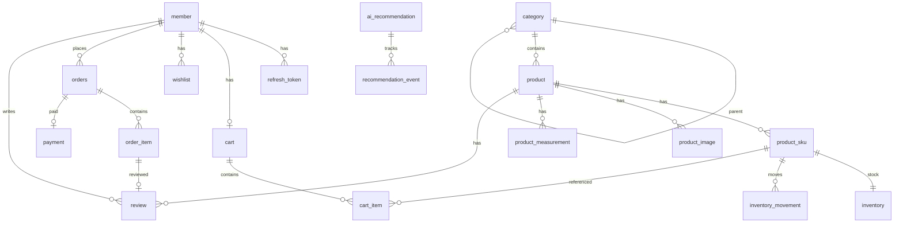

# BoutiqueCamel AI Shop v2 — Architecture

## Overview

모듈형 모놀리스로 구축하는 여성·아동 의류 쇼핑몰 MVP다. 브라우저는 Next.js(BFF)를 통해 Spring Boot REST API를 호출하고, PostgreSQL에 영속화한다.

```text
Browser
  ↓
Next.js Frontend / BFF Route Handler (/api/shop/*)
  ↓
Spring Boot REST API (/api/*)
  ├── auth / member
  ├── category / product / inventory
  ├── cart / wishlist
  ├── order / payment
  ├── review
  ├── recommendation (AI)
  └── admin
  ↓
PostgreSQL 16
```

## Principles

- Controller: 요청 검증·응답 변환만
- Service: 트랜잭션·업무 규칙
- Entity ≠ API 응답 (DTO 분리)
- 재고·주문금액·할인은 서버 계산
- AI는 결제금액·재고를 결정하지 않음
- 외부 서비스는 Provider 인터페이스 뒤
- 시간은 DB `TIMESTAMPTZ`, API는 ISO-8601
- Hibernate `ddl-auto=validate`, 스키마는 Flyway만

## Backend packages

```text
com.BoutiqueCamel.shop
├── auth
├── member
├── category
├── product
├── inventory
├── cart
├── wishlist
├── order
├── payment
├── review
├── recommendation
├── admin
├── security
└── common
```

각 패키지는 `controller` / `service` / `domain` / `repository` / `dto`로 나눈다.

## Frontend structure

```text
src
├── app/(shop) … 고객 화면
├── app/admin … 관리자
├── app/api/shop … BFF proxy
├── components
├── features
├── lib
└── styles
```

- Server Component 우선, 필요 경계만 `use client`
- 토큰은 HttpOnly 쿠키 (Web Storage 금지)
- Browser → `/api/shop/*` → `BACKEND_URL/api/*`

## Auth model

- Access token: 짧은 만료 (기본 1800s), HttpOnly cookie
- Refresh token: 회전(rotation), DB에 hash만 저장
- CSRF: cookie 기반 상태 변경 API 보호
- Roles: `CUSTOMER` / `ADMIN`
- Member status: `ACTIVE` / `DORMANT` / `BLOCKED` / `WITHDRAWN`

## Age policy

나이는 DB에 저장하지 않는다. `birth_date`만 저장하고 서버에서 `Period.between(birthDate, today).getYears()`로 만 나이를 계산한다. timezone은 `Asia/Seoul`로 고정한다.

## Inventory & order flow

1. 장바구니/주문 시 `availableQuantity = stock - reserved` 검증
2. 결제 진행 중 `reserved_quantity` 증가
3. 승인 시 실차감 + `inventory_movement`
4. 실패·취소 시 예약 해제
5. `Idempotency-Key`로 중복 주문 방지
6. `@Version` 낙관적 잠금

## AI providers

```text
OutfitRecommendationProvider
  ├── RuleBasedOutfitRecommendationProvider (default)
  └── OpenAiOutfitRecommendationProvider (OPENAI_API_KEY 있을 때)
```

Key가 없어도 규칙 기반으로 전체 앱이 실행된다. LLM은 백엔드가 조회한 판매가능 상품만 조합한다.

## Payment

`PaymentGateway` + `MockPaymentGateway`만 구현. 실제 PG는 MVP 범위 밖.

## ER diagram



## Deployment

- Local: `docker compose up -d postgres` + 로컬 backend/frontend
- Full stack: `docker compose up --build`
- Secrets: 환경변수만 (이미지 bake 금지)
---

# Implementation checklist

| Phase | Scope | Done |
|------:|-------|:----:|
| 0 | architecture, api-contract, ERD | ☑ |
| 1 | scaffold, Flyway, JPA, sample, tests | ☑ |
| 2 | auth, member, cookies, CSRF, UI | ☑ |
| 3 | design, home, catalog, admin products | ☑ |
| 4 | inventory, cart, wishlist | ☑ |
| 5 | orders, mock payment | ☑ |
| 6 | reviews, AI | ☑ |
| 7 | admin full | ☑ |
| 8 | QA, Playwright, Docker, docs | ☑ |
